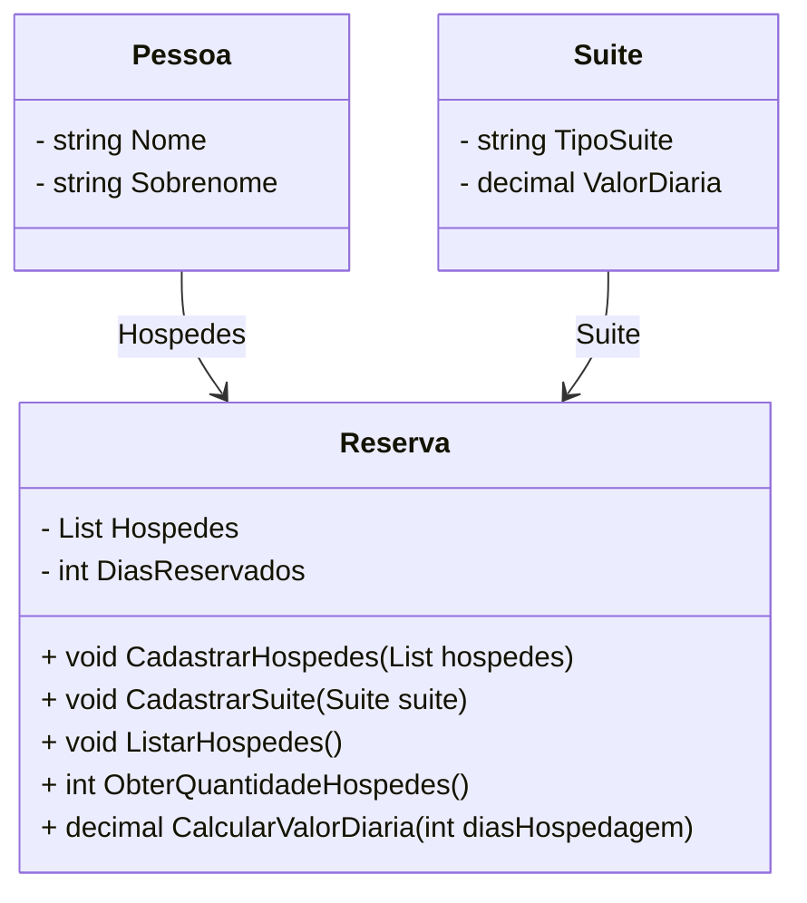

# DIO Desafio - Hotel Sistema Hospedagem
Desafio DIO - Desenvolvimento de um sistema de hospedagem de um hotel com C#

## Autor
- [Felipe Figueiredo Bezerra](https://github.com/FigFelipe)

## Desafio proposto

Realizar uma reserva no hotel de acordo com a quantidade de hóspedes recebida e tipo de súite.

#### Objetos á representar

[](https://github.com/digitalinnovationone/trilha-java-basico/tree/main/desafios/poo#funcionalidades-a-modelar)

|Objeto|Descrição|
|--|--|
|Hóspede| Recebe o nome e o sobrenome|
|Suíte| Possui um tipo, capacidade de lotação e um custo diário|
|Reserva| É composta pelos objetos 'Hóspede' e 'Suíte' Realiza a reserva de acordo com a quantidade de hospedes, suíte e dias reservados|


## Resolução do Desafio

> **Nota:** O exercício foi desenvolvido como atividade de aprendizado, podendo conter falhas de interpretação, ou implementação. Portanto, sugestões de correção ou colaboração de terceiros sempre serão bem-vindas.

#### Ambiente de Desenvolvimento

 - **IDE**: Visual Studio 22 (Community Edition)
 - **SDK:** .NET 8.0

## Modelamento UML sugerida


## Exemplo de Entrada / Saída
* Cadastro de 1 (um) unico hóspede, 10 (dez) dias de duração de hospedagem:

Entrada
```
 --- Sistema de Hospedagem ---

   1. Cadastro de hóspedes
     --> Informe o nome (simplesmente pressione <ENTER> para sair...): hospede um

```

Saída
```
 --- RESUMO DA RESERVA ---

  --> Quantidade de hóspedes: 1

        1. Hospede Um

 --- Suíte recomendada ---

  --> Suíte 'Comum', até 3 hóspedes, R$30,00/dia

  --> Dia(s) de hospedagem: 10

  --> TOTAL: R$300,00
```

   
* Cadastro de 5 (cinco) hóspedes, 10 (dez) dias de duração de hospedagem:

Entrada
```
 --- Sistema de Hospedagem ---

   1. Cadastro de hóspedes
     --> Informe o nome (simplesmente pressione <ENTER> para sair...): hospede um
     --> Informe o nome (simplesmente pressione <ENTER> para sair...): hospede dois
     --> Informe o nome (simplesmente pressione <ENTER> para sair...): hospede tres
     --> Informe o nome (simplesmente pressione <ENTER> para sair...): hospede quatro
     --> Informe o nome (simplesmente pressione <ENTER> para sair...): hospede cinco
```

Saída
```
 --- RESUMO DA RESERVA ---

  --> Quantidade de hóspedes: 5

        1. Hospede Um
        2. Hospede Dois
        3. Hospede Tres
        4. Hospede Quatro
        5. Hospede Cinco

 --- Suíte recomendada ---

  --> Suíte 'Premium', a partir de 4 hóspedes, R$50,00/dia

  --> Dia(s) de hospedagem: 10

   >> GANHOU DESCONTO - 10% OFF! <<

  --> TOTAL: R$450,00
```

